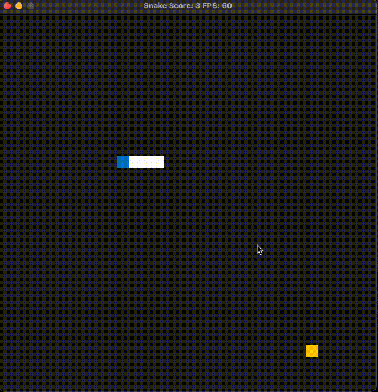
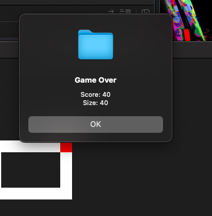
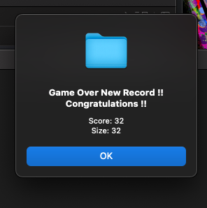

# CPPND: Capstone Snake Game Example

This is a starter repo for the Capstone project in the [Udacity C++ Nanodegree Program](https://www.udacity.com/course/c-plus-plus-nanodegree--nd213). The code for this repo was inspired by [this](https://codereview.stackexchange.com/questions/212296/snake-game-in-c-with-sdl) excellent StackOverflow post and set of responses.
## ORIGINAL VERSION

## NEW VERSION

The Capstone Project gives you a chance to integrate what you've learned throughout this program. This project will become an important part of your portfolio to share with current and future colleagues and employers.

In this project, you can build your own C++ application or extend this Snake game, following the principles you have learned throughout this Nanodegree Program. This project will demonstrate that you can independently create applications using a wide range of C++ features.

## Dependencies for Running Locally
* cmake >= 3.7
  * All OSes: [click here for installation instructions](https://cmake.org/install/)
* make >= 4.1 (Linux, Mac), 3.81 (Windows)
  * Linux: make is installed by default on most Linux distros
  * Mac: [install Xcode command line tools to get make](https://developer.apple.com/xcode/features/)
  * Windows: [Click here for installation instructions](http://gnuwin32.sourceforge.net/packages/make.htm)
* SDL2 >= 2.0
  * All installation instructions can be found [here](https://wiki.libsdl.org/Installation)
  >Note that for Linux, an `apt` or `apt-get` installation is preferred to building from source. 
* gcc/g++ >= 5.4
  * Linux: gcc / g++ is installed by default on most Linux distros
  * Mac: same deal as make - [install Xcode command line tools](https://developer.apple.com/xcode/features/)
  * Windows: recommend using [MinGW](http://www.mingw.org/)

## Basic Build Instructions

1. Clone this repo.
2. Make a build directory in the top level directory: `mkdir build && cd build`
3. Compile: `cmake .. && make`
4. Run it: `./SnakeGame`.

## NEW UPDATES

1. ADDED MAINTAINING HIGHEST SCORE ACHIVED BY PLAYER.

    This feature will store the high score on the local machine so that every time the player scores higer than the previous then it will store the score in the local machine so next time it will be easy for the player to beat that score...!

2. ADDED SUPER FOOD FOR MORE FUN:

    This feature will introduce a super food(green) in the game in between normal(yellow) food.
    This gives player an advantage of getting more score by eating this food in between.
    Special Challenge is such that this super food will give more point, depending upon how quick player is able to eat it.
    if player eats with in 1 sec the he/she will get 5 points.
    accordingly after each second the points that player can earn will be reduced by 1
    after 5 secondes the value of super food will be reduced to 1 point.

    if super food is ate  <= 1 sec then point will be 5

    if super food is ate 1 > & <= 2 sec then point will be 4

    if super food is ate 2 > & <= 3 sec then point will be 3

    if super food is ate 3 > & <= 4 sec then point will be 2

    LIKEWISE...

3. PLAYER CAN NOW PAUSE/RESUME THE GAME BY PRESSING THE SPACE BAR.

    While playing the game if required player can pause the game by pressing the space bar and then again press the space bar the game will resume..!

4. ADDED GAME OVER DIALOG BOX

    after game is finished the dialog box will automatically appear and will show the game details.

## Rubric Points

### Loops, Functions, I/O
The Project is using Loops for operions and functions for implementing various functionalities.
The Project is using I/O functionalies [click here](https://github.com/surajtakale/CppND-Capstone-Snake-Game/blob/master/src/metadata.cpp#L37) for taking input from user and displaying output.
The Project is using File IO for Maintaining High Score achived by player.

### Object Oriented Programming
This is project is built using Object Oriented Programming (OOP)
Each Class is represents blueprint or template for creating objects (instances). It defines the structure and behavior of objects of that type. A class encapsulates the data (attributes or properties) and methods (functions or behaviors) that the objects created from it will possess.
Created a new class [MetaData](https://github.com/surajtakale/CppND-Capstone-Snake-Game/blob/master/src/metadata.h#L11)
tha is used to store the metadata information like High Score on the file system. 

### Memory Management
This project is using memory management technique for efficient memory management
Smart pointer are used to manage the the memory access in such a way thet memory will be utilized in a proper manner.
When a super Food is placed in the game,
To calculate the the time spent to eat the food and to calculate the points to the player used [shared_pointer](https://github.com/surajtakale/CppND-Capstone-Snake-Game/blob/master/src/game.cpp#L135).

### Concurrency
This project is using concurrency by using threads library API's
When a super Food is placed in the game and player eats that super food within 2 seconds the snake's speed will be reduced for 
5 seconds and after time that it will resume the speed.
for this, after super food is ate by snake in < 3 seconds, a thread will be spwanned and it will wait for 5 seconds and after that it will restore the original speed of the snake. [click here to see code](https://github.com/surajtakale/CppND-Capstone-Snake-Game/blob/master/src/game.cpp#L121)
## CC Attribution-ShareAlike 4.0 International

Shield: [![CC BY-SA 4.0][cc-by-sa-shield]][cc-by-sa]

This work is licensed under a
[Creative Commons Attribution-ShareAlike 4.0 International License][cc-by-sa].

[![CC BY-SA 4.0][cc-by-sa-image]][cc-by-sa]

[cc-by-sa]: http://creativecommons.org/licenses/by-sa/4.0/
[cc-by-sa-image]: https://licensebuttons.net/l/by-sa/4.0/88x31.png
[cc-by-sa-shield]: https://img.shields.io/badge/License-CC%20BY--SA%204.0-lightgrey.svg
